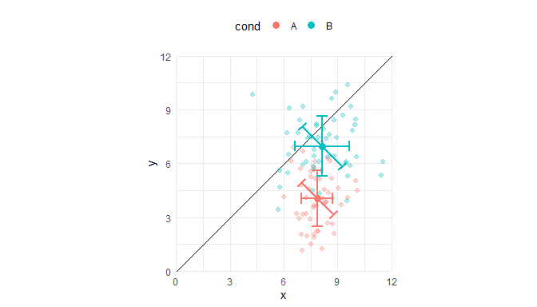

<!-- README.md is generated from README.Rmd. Please edit that file -->

# ggerrorbard

<!-- badges: start -->
<!-- badges: end -->


Building on `ggplot2`, the goal of `ggerrorbard` is to draw diagonal
error bars (instead of standard vertical or horizontal error bars).

## Installation

You can install the development version of `ggerrorbard` from GitHub
like this:

``` r
# install.packages("devtools")
devtools::install_github("lmwidmayer/ggerrorbard")
```

## Example

This is a basic example how to plot the error bars:

``` r
library("dplyr")
library("ggplot2")
library("ggerrorbard")

# rm(list = ls())
set.seed(12)

# dummy data
n <- 50
dat <- data.frame(
  x = c(
    rnorm(n, m = 8, sd = 1),
    rnorm(n, m = 8, sd = 1.75)
  ),
  y = c(
    rnorm(n, m = 4, sd = 1.5),
    rnorm(n, m = 7, sd = 1.75)
  ),
  cond = rep(c('A', 'B'), each = n)
)


# summary of data
dat$d <- with(dat, y - x) # pairwise difference of x and y
agg <- dat %>%
  group_by(cond) %>%
  summarise(x = mean(x),
            y = mean(y),
            d_M = mean(d),
            d_SD = sd(d),
            d_SE = sd(d) / sqrt(n()),
            n = n())

# plot
ggplot(
  data = dat,
  mapping = aes(
    x = x, y = y,
    group = cond,
    color = cond
  )
) +
  geom_abline(intercept = 0, slope = 1) +
  geom_point(alpha = 0.3, shape = 20, size = 3) +
  geom_point(
    data = agg,
    mapping = aes(
      x = x, y = y,
      group = cond,
      color = cond
    ),
    shape = 19, size = 3
  ) +
  ggerrorbard::geom_errorbard(
    data = agg,
    mapping = aes(
      x = x, y = y, # center points of error bars
      group = cond,
      color = cond,
      latitude = 2 * d_SD / sqrt(2), # width of error bars
      angle = -45
    ), # angle of error bars
    # arrows on ends of error bars
    arrow = arrow(
      angle = 90,
      ends = "both",
      length = unit(0.05, "npc")
    ),
    linewidth = 1.1
  ) +
  scale_x_continuous(expand = c(0, 0), limits = c(0, 12)) +
  scale_y_continuous(expand = c(0, 0), limits = c(0, 12)) +
  guides(color = guide_legend(override.aes = list(linetype = 0))) +
  coord_equal() +
  theme_minimal() +
  theme(legend.position = "top")
```

<div class="figure">


<p class="caption">
Pairwise differences. Error bars indicate the standard deviations.
</p>

</div>

## Limitations

- The error bars get distorted by transformations of the plotting
  coordinate system, e.g. `coord(x = "log10", y = "log10")`

<!--
You'll still need to render `README.Rmd` regularly, to keep `README.md` up-to-date. `devtools::build_readme()` is handy for this.
-->
